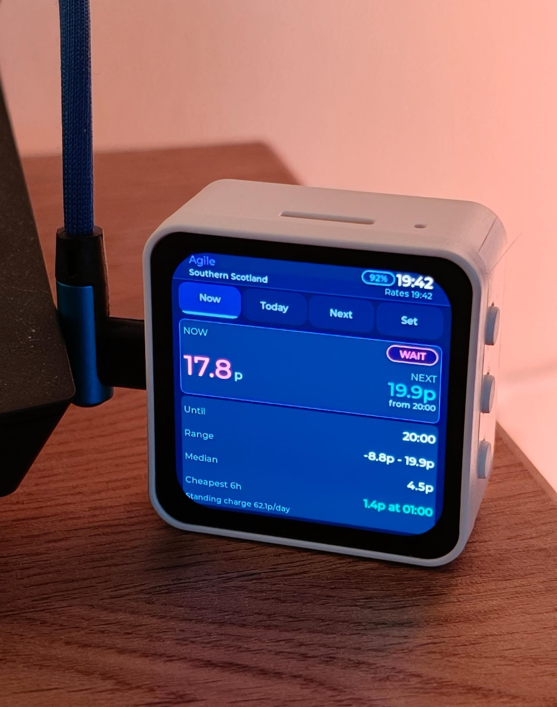

# Octopus Agile tracker

Live **Octopus Agile** electricity rates on a small display — built for **Southern Scotland (N)** / tariff `AGILE-24-10-01`.

Two targets:

| Platform | Folder | Display |
|----------|--------|---------|
| **ESP32-C6 AMOLED** (recommended) | `esp32/Agile_Tracker/` | 480×480 round touch, colour |
| Raspberry Pi + 2.13" e-ink (legacy) | `main.py` + `tracker/` | 250×122 monochrome |

Data comes from the public Octopus API (no API key needed for rates).



*Waveshare ESP32-C6-Touch-AMOLED-2.16 — Now tab at 17.8p, next 19.9p from 20:00.*

---

## ESP32 — Waveshare ESP32-C6-Touch-AMOLED-2.16

### Features

- **Now** — current rate, next slot, run score (RUN NOW / GOOD / OK / WAIT), stats
- **Today** — colour bar chart (48 half-hour slots), time axis, cheap/avg/peak key
- **Next** — tomorrow min/max, best 2h window, cheapest slots, peak
- **Set** — brightness slider, auto night dim (22:00 → 06:30), device info
- Swipe between tabs; auto-refresh every 15 minutes
- Hold **KEY** to cycle display rotation (all four sides)
- Hold **BOOT** for next tab; KEY/BOOT short-press brighter/dimmer
- Negative-rate flash + “PAID TO USE” when Agile goes below 0p

### Quick start (Arduino IDE)

1. **Board:** [arduino-esp32](https://docs.espressif.com/projects/arduino-esp32/) **v3.3.0+**, board **ESP32C6 Dev Module**.
2. **Libraries** (do not use generic LVGL from Library Manager):
   ```powershell
   powershell -ExecutionPolicy Bypass -File scripts\install-arduino-libraries.ps1
   ```
3. **WiFi:** copy `esp32/Agile_Tracker/secrets.h.example` → `secrets.h` and add your SSID/password.
4. Open `esp32/Agile_Tracker/Agile_Tracker.ino`, compile, upload.
5. Restart Arduino IDE completely after the library install.

### Customise region / tariff

Edit `esp32/Agile_Tracker/agile_config.h` (`AGILE_REGION`, `AGILE_TARIFF_CODE`, labels).

### Troubleshooting

| Problem | Fix |
|---------|-----|
| Display blank | Run Waveshare `09_LVGL_V9_Test` first; check USB power |
| WiFi fails | Check `secrets.h`; ESP32-C6 needs 2.4 GHz WiFi |
| Font/build errors | Re-run `install-arduino-libraries.ps1`; restart IDE |
| Tomorrow empty before 4pm | Normal — day-ahead publishes ~4pm UK |
| Touch wrong in portrait | Report which rotation — touch mapping may need a tweak |

---

## Raspberry Pi + e-ink (legacy)

```bash
pip install -r requirements.txt
python main.py --preview --once   # test on PC (writes PNGs to preview/)
python main.py                    # on Pi with display attached
```

Pi install: `scripts/install-pi.sh`. Set `epd_driver: V4` or `V2` in `config.yaml`.

---

## Repo layout

```
tracker/
├── esp32/Agile_Tracker/     # ESP32 firmware (your main project)
│   ├── Agile_Tracker.ino
│   ├── agile_*.cpp/h        # API, store, UI
│   ├── bsp_*.cpp/h          # display, buttons, orientation
│   ├── src/                 # Waveshare BSP (LCD, PMIC, IMU)
│   ├── secrets.h.example    # copy to secrets.h (gitignored)
│   └── libraries/           # installed by script — not in git
├── tracker/                 # Python e-ink app modules
├── scripts/                 # install + cleanup scripts
├── docs/                    # Photos / screenshots for README
│   └── device.jpeg
├── main.py                  # Pi e-ink entry point
├── config.yaml
├── requirements.txt
├── systemd/                 # Pi service unit
├── README.md
└── GIT.md                   # how to push to GitHub
```

### Safe to delete locally (reinstalled by scripts)

| Folder | Why |
|--------|-----|
| `.arduino/` | Local Arduino sketchbook + libraries |
| `_waveshare_ref/` | Cloned Waveshare repo (install source) |
| `esp32/Agile_Tracker/libraries/lvgl/` | Large LVGL tree |
| `esp32/Agile_Tracker/libraries/XPowersLib/` | PMIC library |
| `esp32/Agile_Tracker/libraries/ArduinoJson/` | Unused leftover — not required |
| `tracker/lvgl8/`, `tracker/lvgl9/` | Duplicate LVGL — not used |
| `preview/` | Generated PNG previews |
| `.venv/`, `__pycache__/` | Python cache |

One command to remove all of the above:

```powershell
powershell -ExecutionPolicy Bypass -File scripts\clean-local-artifacts.ps1
```

Then reinstall libraries before your next compile:

```powershell
powershell -ExecutionPolicy Bypass -File scripts\install-arduino-libraries.ps1
```

---

## API

```
https://api.octopus.energy/v1/products/AGILE-24-10-01/electricity-tariffs/E-1R-AGILE-24-10-01-N/standard-unit-rates/
```

Standing charge (separate endpoint) is fetched for the footer line on Now/Next tabs.

---

## GitHub

See **[GIT.md](GIT.md)** for first-time push, what never to commit, and clone/setup on a new machine.

---

## Licence

Firmware and Python app: use and modify freely. Third-party libraries (LVGL, XPowersLib, Waveshare BSP) remain under their own licences — install via the scripts rather than vendoring in git.
